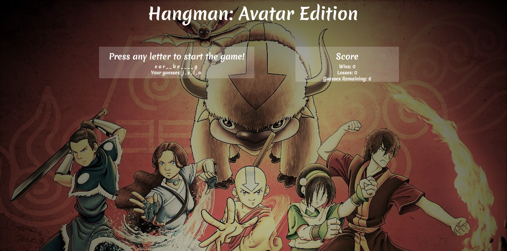

# Hangman-Game
Created a Hangman game with an _Avatar: The Last Airbender_ theme. JavaScript was used to handle the logic of randomly selecting a word, replacing blanks with correct letters, wins / loses, and tracking the number of guesses remaining.

**Technology used:** JavaScript, HTML, and CSS.

### Rules of the Game
1. Guess the selected word within 10 guesses.
1. If a letter is guessed that is not in the word, that will count against the number of guesses remaining and Guesses Remaining will decrement.
1. If a letter is guessed correctly, the letter will replace the blank(s) in the word.
1. If the word is solved before the number of guesses remaining goes to zero, the user wins and Wins is incremented. If the word is not solved and the user runs out of guesses, then the user loses and Losses is incremented.
1. A new game will automatically begin if either the number of guess remaining goes to zero or if the winner correctly guesses the word.

Below is a screenshot of the game:
